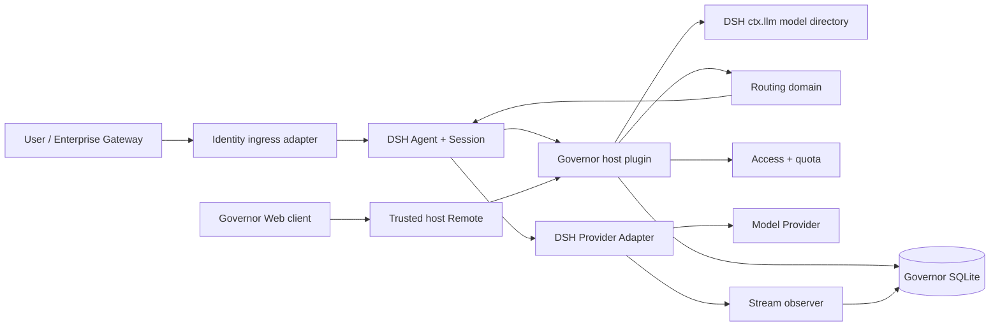
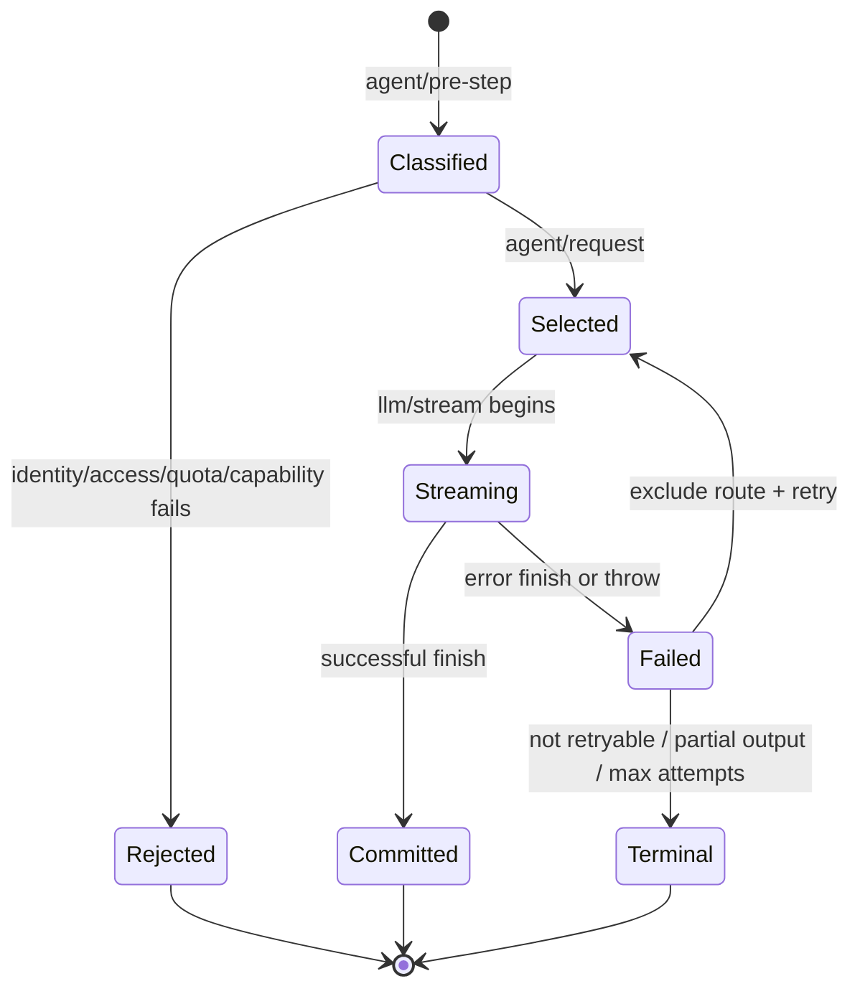

# DSH LLM Governor 技术方案

状态：Implementation-ready design，版本 1.0，2026-08-20。

## 1. 结论

`dsh-llm-governor` 应实现为 DSH Cordis 插件，而不是模型 Proxy。Host 插件通过
DSH 的模型目录、Agent Waterfall、LLM Stream 和 Session Event 执行治理；Web
Client 只负责管理界面。Provider、API Key、真实请求和模型协议继续由 DSH Adapter
负责。

核心请求路径为：

```text
Identity bound to session
  -> classify current turn
  -> read next DSH call config
  -> Enabled / Access / Capability / Availability / Quota
  -> select provider:model
  -> DSH adapter streams request
  -> observe attempt usage and finish
  -> success: commit Usage
  -> retryable failure: exclude route, re-run same strategy
```

该设计满足产品边界，同时不侵入 DSH 核心。

## 2. 上游基线与兼容策略

截至 2026-08-20：

- npm `@deepseek-ai/dsh` 的 `latest` 为 `0.1.0-rc.7`，`next` 为 rc.8。
- 本次核对的 DSH 主干提交为 `141eb6fef83422698aef7a981029e843e8161534`；
  根版本为 rc.8，Node 要求 `^22.19.0 || >=24.0.0`。
- 官方明确 DSH 仍在 developer preview，可能发生破坏性变更。
- DSH 的模型目录是 advisory，不是请求白名单；真正的路由键是
  `GenerateOptions.provider + model`。

因此首版以 rc.7 为最低支持版本，CI 同时跑 rc.8 合同测试。DSH 类型、事件名、
Client Remote 和 bundle 组合全部隔离到 `src/dsh-adapter/` 与 `src/plugin/`；领域层
不 import DSH。

参考：

- https://github.com/deepseek-ai/deepseek-harness
- https://github.com/deepseek-ai/deepseek-harness/blob/master/docs/architecture.md
- https://github.com/deepseek-ai/deepseek-harness/blob/master/docs/subsystems/llm-streaming.md
- https://github.com/deepseek-ai/deepseek-harness/blob/master/docs/agent-lifecycle.md

## 3. 系统架构



Governor 不在 Provider 与 DSH 之间增加 HTTP 转发层。它只在 DSH 已提供的控制点
改写请求配置、观察流和记录结果。

## 4. DSH 集成点

| DSH 契约 | Governor 用途 | 限制 |
| --- | --- | --- |
| `ctx.llm.listProviders()` | 活动 Provider 路由 | 只表示已注册，不代表健康 |
| `ctx.llm.listModels(provider)` | 建议模型目录与输入模态 | 目录是 advisory，缺席不等于模型非法 |
| `agent/pre-step` | 捕获本步新消息、Hint、图片并分类 | 不改写 Prompt，不记录正文 |
| `agent/request` | 读取下游 LlmCallConfig，执行准入并返回 provider/model | Waterfall 返回新对象，禁止原地修改 |
| `llm/stream` | 观察真实 attempt、Token、finish、首个语义 chunk、时延 | 必须保持 AsyncIterable 顺序和取消语义 |
| `agent/request-error` | 判断失败能否 Fallback，持久化排除集并返回 retry | Governor 启用时只能有一个 Recovery Owner |
| `session/event` | 关联 assistant usage、step/end、turn/end 与清理状态 | 通过 declaration merge 增加 Governor 事件 |

### 4.1 为什么要统一 Recovery Owner

官方 `dsh-llm-retry` 与 Governor 都监听 `agent/request-error`。如果同时拥有恢复权，
同一失败可能先重试原 Provider，再由 Governor Fallback，实际次数、退避和 Credits
不可预测。

最终 bundle 必须二选一并由集成测试证明：

1. Governor bundle 禁用基础 `llm-retry`，由 Governor 同时实现可选同路由 Retry 与
   Fallback；这是推荐方案。
2. 若后续 DSH 提供显式 Recovery Priority/Chain 契约，则按该契约组合。

在 Phase 0 证明之前，`cordis.patch.yml` 只保留插入草案，不提前修改真实 Profile。

## 5. 请求状态机



同一 `(session_id, turn, step)` 的第一次选择创建随机 UUID `request_id`。Fallback
仍在同一逻辑 request 下，`fallback_index` 从 0 递增。每次 `agent/request` 都重新执行
Access、Capability、Quota 和 Availability，不能复用已经过期的准入结果。

## 6. 模块边界

| 模块 | 职责 |
| --- | --- |
| `identity` | Local/Header/JWT/Custom，session 与 user_id 绑定 |
| `model` | 合并 DSH 目录与治理画像，生成 canonical route |
| `access` | 默认模型集合和用户 allow list |
| `credits` | 定点换算、月度窗口、准入查询 |
| `routing` | 四种策略、候选过滤、稳定排序、Decision Record |
| `classifier` | Hint / Rule / LLM、缓存、复杂度和置信度 |
| `fallback` | 错误分类、排除集、attempt 上限、部分输出保护 |
| `usage` | Stream 观察、attempt 聚合、统计查询 |
| `storage` | SQLite migration、repository、事务和幂等 |
| `dsh-adapter` | DSH 类型、事件、目录与 stream glue |
| `plugin` | Cordis apply/dispose、service 和 bundle 入口 |
| `ui` | Web Models / Users / Usage 页面与 host Remote |

## 7. 模型目录与治理画像

### 7.1 Canonical route

DSH 的真实模型身份不是单独的 model id，而是：

```text
route_id = provider + ":" + model
```

所有配置、Access、Usage 和 Decision Record 使用 `route_id`。Manual 输入允许裸
model id，但只有它在活动 Provider 中唯一时才解析；冲突时返回
`AMBIGUOUS_MODEL_ROUTE`，不猜 Provider。

### 7.2 合并规则

启动和 `llm/adapters-updated` 后刷新目录：

1. `listProviders()` 得到活动 Provider。
2. 对每个 Provider 调用 `listModels()`，读取 name、description、inputModalities。
3. 合并 DB 中的 Enabled、Multiplier、Capability、Quality。
4. 治理配置中存在、目录中缺席的模型可以保留，因为官方目录是 advisory；但其
   Provider 必须活动。
5. DSH 明确声明不支持的输入模态优先于 Governor 配置，不能通过治理配置伪造。
6. 未配置 Multiplier 使用 1x；未配置 Quality 不允许进入依赖该维度的自动策略。

模型热更新以不可变 snapshot 发布；一个 request 的全部 attempts 固定
`config_revision`，但每个 attempt 仍重新检查 Disabled、Access 和 Quota。管理员禁用
模型后，下一次 attempt 立即排除。

## 8. Identity 与 Access

### 8.1 IdentityProvider

```ts
interface IdentityProvider {
  resolve(context: IdentityContext): Promise<GovernorIdentity>;
}
```

- `local`：返回配置的固定 user_id，默认 `local`。
- `header`：由 Web 入站 adapter 在可信反向代理之后读取 Header，并在 Agent 首次
  使用前绑定 session。
- `jwt`：验证签名、允许算法、issuer、audience、exp、nbf 后映射 subject claim。
- `custom`：由第三方插件向 `ctx.governor.identity` 注册 Provider。

`agent/request` 本身没有 HTTP Request，不能在该事件中“读取 Header”。Header/JWT
必须在创建 session 或提交首条消息的入站边界完成绑定。无绑定、绑定过期或
user_id 为空时 fail closed。展示属性可以保存受限 JSON，但治理主键只有 user_id。

### 8.2 信任边界

- Header 模式必须配置可信代理来源；代理必须覆盖并删除客户端伪造 Header。
- JWT 禁止 `alg=none`，禁止只 decode 不 verify，密钥轮换失败时拒绝新请求。
- MVP 管理员是 DSH 进程/配置所有者，不实现 `admin` RBAC。
- Usage 和 Decision Record 不保存 Prompt、JWT、API Key 或完整 Header。

### 8.3 Access 语义

用户 allow list 为空表示使用全局默认可用模型；非空表示只允许显式 route_id。
候选过滤时先求全局可用集合，再与 allow list 取交集。Manual、Auto、Fallback 使用
同一 `AccessEvaluator`，没有旁路。

## 9. Credits 与月度 Quota

### 9.1 计量

Multiplier 保存为 parts-per-million：`1x = 1_000_000 ppm`。Credits 保存为
`credit_nanos`：`1 Credit = 1_000_000_000 nanos`。

```text
total_tokens = input + cache_read + cache_write + output
credit_nanos = ceil(
  total_tokens * multiplier_ppm * 1_000_000_000
  / tokens_per_credit / 1_000_000
)
```

计算使用 BigInt，入库前验证 SQLite signed 64-bit 范围。`reasoningTokens` 是
outputTokens 的子集，不重复相加。Provider 未返回 Usage 时仍记录 attempt，但
credits 为 0、`usage_missing=true`，并计入数据质量告警。

### 9.2 月份与并发

月度窗口按配置的 IANA 时区计算，默认 UTC。额度是 admission control：每个实际
attempt 开始前读取已提交 Credits；若 `used >= limit`，拒绝调用。已经在途的请求不被
截断，因此并发请求可能让最终值略高于额度。该语义可预测且不会破坏流；如未来要求
绝对硬上限，再增加 reservation，不在 MVP 暗中预留虚构 Token。

Fallback 是新 attempt，必须重新检查 Quota。分类器调用单独标记
`usage_kind=classifier`，默认计入调用者 Credits，防止分类成本变成免费旁路。

## 10. Routing

### 10.1 公共候选过滤

所有策略共享以下顺序：

```text
active provider
-> enabled
-> access allowed
-> required capabilities and modalities
-> not excluded in this request
-> circuit/availability permits attempt
-> quota admits attempt
```

每个排除项写稳定 reason code。过滤后为空返回可诊断错误，不静默绕过条件。

### 10.2 Manual

Manual 读取 `await next()` 返回的 provider/model，解析 canonical route 后只做公共
过滤。成功时原样返回该 route；失败时拒绝，绝不自动替换成另一个模型。Fallback
是 Manual 的唯一例外：只有显式启用 Fallback 时，失败后对剩余允许模型按配置的
`fallback.strategy` 重新选择，默认 `quality_first`。

### 10.3 Quality First

对当前 task_type 的 Quality 降序排序。Tie-break 固定为：

1. Multiplier 升序。
2. canonical route 字典序。

缺少该 task Quality 的模型被排除为 `quality_missing`。

### 10.4 Credit First

先过滤 `quality[task_type] >= minimum_quality`，再排序：

1. Multiplier 升序。
2. Quality 降序。
3. canonical route 字典序。

无模型达标返回 `NO_MODEL_MATCHED`。只有配置
`on_no_match: quality_first` 时才显式切换，不偷偷降低门槛。

### 10.5 Auto

分类结果固定为：

```json
{
  "task_type": "coding",
  "complexity": "high",
  "confidence": 0.93
}
```

分类顺序：

1. Context Hint：Agent preset、图片输入、调用方显式 route hint。
2. Rule：代码块、错误栈、SQL/表格、图片、Tool 上下文等确定性规则。
3. LLM：A/B 不能确定时，通过 `ctx.llm.stream()` 调用配置的轻量模型；Governor
   不直连 Provider。

LLM classifier 使用 temperature=0、短输出、严格 JSON 和超时。缓存键包含规范化
输入哈希、classifier route、Prompt 版本和配置 revision，使同一输入+配置重复决策
稳定。非法输出、超时或 `confidence < threshold` 时切 Quality First。

置信度达标时，复杂度映射到 minimum_quality，再在达标模型中执行 Credit First。
默认阈值：low 75、medium 85、high 92。

### 10.6 Decision Record

每个 attempt 保存：request_id、strategy、classification、minimum_quality、候选
route/quality/multiplier、排除 route/reason、selected、config_revision 和时间。
不保存 Prompt 原文。候选与排除列表设置数量和字节上限，防止放大 SQLite。

## 11. Fallback

默认触发条件：

- HTTP 429。
- DSH 标准 `TIMEOUT`。
- HTTP 500..599。
- 明确的 Provider Unavailable / transport unavailable code。

默认不触发：用户取消、401/403、非法参数、内容安全拒绝、Context Window
Exceeded、Quota、Access、Capability、分类器失败。

`max_attempts` 定义为总 Provider attempts，包含首次调用。值 2 表示 A 失败后最多
调用一次 B。失败 route 加入本 request 的 excluded set，下一次 `agent/request`
重新运行原策略。所有 attempts 共享 request_id。

透明 Fallback 的安全边界：在首个 text/reasoning/tool-call 语义 chunk 已交付后，默认
不切模型，因为可能产生重复文本或 Tool 副作用；`after_partial_output=false` 是安全
默认。管理员若显式开启，UI 必须标记输出可能重复，该模式不进入首版验收。

可选的短时 circuit breaker 只影响 availability：连续失败达到阈值后临时排除 route，
成功或冷却到期恢复。它不替代 Provider 健康检查，也不跨进程声称全局健康。

## 12. Usage 与统计

一条 Usage 对应一次下游 `ctx.llm` attempt，而不是一次逻辑用户请求。外部
`llm/stream` middleware 理论上可以在 Provider Adapter 前短路请求；在 DSH 未提供
明确的 wire-start 事件前，Usage 额外记录 `attempt_origin`。只有观察到 Provider
usage、Provider failure/request id，或已验证没有短路 middleware 时才标记
`provider`；其余标记 `middleware_or_unknown`，统计不伪称已经发生 Provider HTTP。
字段至少包括：

```ts
interface UsageEvent {
  id: string;
  requestId: string;
  sessionId: string;
  turn: number;
  step: number;
  userId: string;
  provider: string;
  model: string;
  routingMode: RoutingMode;
  taskType?: TaskType;
  inputTokens: number;
  outputTokens: number;
  cacheReadTokens: number;
  cacheWriteTokens: number;
  reasoningTokens?: number;
  creditNanos: bigint;
  success: boolean;
  finishKind?: string;
  errorCode?: string;
  httpStatus?: number;
  latencyMs: number;
  fallbackIndex: number;
  attemptOrigin: "provider" | "middleware_or_unknown";
  usageMissing: boolean;
  createdAt: string;
}
```

Stream observer 用 try/finally 包装 AsyncIterable，不能提前消费。看到 usage chunk 时
保存计量；看到 finish 或 throw 时结束 attempt。重复 Session 事件和进程恢复通过
唯一键 `(request_id, fallback_index)` 保证不双计费。

统计：

- User：Raw Tokens、Credits、Requests、模型分布。
- Model：Requests、Tokens、Credits、Success Rate、Average/P95 Latency、Fallback Rate。
- Routing：请求量、平均 Credits、成功率、Quality Retention、Credit Saving。

逻辑 Requests 用 `count(distinct request_id)`，实际 Attempts 用行数，UI 不混用。

## 13. SQLite 设计

数据库默认位于 `$DSH_HOME/dsh-llm-governor/governor.db`，目录和文件 owner-only，
本地磁盘使用 WAL。迁移失败时插件 fail closed，不以空库继续。

| 表 | 关键字段 | 用途 |
| --- | --- | --- |
| `schema_migrations` | version, applied_at | 显式迁移 |
| `model_policies` | route_id PK, provider, model, enabled, multiplier_ppm, quality_json | 模型画像 |
| `user_policies` | user_id PK, monthly_credit_nanos | 用户额度 |
| `user_model_allow` | user_id + route_id UNIQUE | 白名单 |
| `session_identities` | session_id PK, user_id, source, expires_at | 身份绑定与恢复 |
| `routing_decisions` | request_id + fallback_index UNIQUE | 可解释决策 |
| `usage_events` | request_id + fallback_index UNIQUE | attempt 计量 |
| `classifier_cache` | input_hash + config_revision UNIQUE | 稳定分类 |

`usage_events` 建索引 `(user_id, created_at)`、`(route_id, created_at)`、
`(routing_mode, created_at)` 和 `request_id`。JSON 字段写入前验证、规范化并限制大小。

原始需求给出的五张概念表保持为产品视图；额外的 migration、allow、identity、cache
表是为数据完整性和可恢复性做的内部实现，不扩张产品功能。

## 14. 配置与状态优先级

全局设置来自 `governor.yml` / DSH settings：Identity 模式、tokens_per_credit、默认
routing、Auto 阈值、Fallback。模型画像和用户策略以 DB 为运行时权威，YAML 中的
`models/users` 仅在首次启动或显式 import 时写入；启动不会覆盖 UI 修改。

每次管理写入在事务中增加 `config_revision`。Decision Record 固定使用的 revision，
从而能够重放“当时为什么这样选”。配置热更新先完整验证，再原子替换 snapshot；
非法新配置保留旧 snapshot 并报告错误。

## 15. Host Service 与 Web UI

Host 插件提供 `ctx.governor`：

```ts
interface GovernorService {
  listModels(query?: ModelQuery): Promise<ModelView[]>;
  updateModel(routeId: string, patch: ModelPolicyPatch): Promise<ModelView>;
  listUsers(query?: UserQuery): Promise<UserView[]>;
  updateUser(userId: string, patch: UserPolicyPatch): Promise<UserView>;
  queryUsage(query: UsageQuery): Promise<UsagePage>;
  explainDecision(requestId: string): Promise<DecisionView[]>;
  bindIdentity(sessionId: string, identity: GovernorIdentity): Promise<void>;
}
```

Web Client 注册 Governor 设置入口和 Models / Users / Usage 三个页面，通过 DSH
受信 API Remote 调用 Host；浏览器不能直接打开 SQLite。列表必须分页，时间查询有
最大跨度，导出是后续能力。

Headless Profile 不加载 Client，仍执行完整治理并可通过结构化 Model Tool 或 CLI
查询当前用户用量；管理写入默认只允许本地进程所有者。

## 16. 错误契约

稳定错误码至少包括：

- `IDENTITY_REQUIRED`
- `IDENTITY_INVALID`
- `MODEL_NOT_FOUND`
- `AMBIGUOUS_MODEL_ROUTE`
- `MODEL_DISABLED`
- `MODEL_ACCESS_DENIED`
- `CAPABILITY_NOT_SUPPORTED`
- `QUOTA_EXCEEDED`
- `NO_MODEL_MATCHED`
- `FALLBACK_EXHAUSTED`
- `PARTIAL_OUTPUT_NOT_RETRYABLE`
- `GOVERNOR_STORAGE_UNAVAILABLE`

错误返回安全摘要和 request_id，不包含 Prompt、JWT、API Key、Provider 响应正文或
SQL 细节。

## 17. 可观测性与隐私

- 决策、Usage、配置变更使用结构化日志并带 request_id。
- 默认不保存消息、系统 Prompt、Tool 参数/结果、JWT 或 Header。
- displayName/email/attributes 默认不进入 Usage，只有 user_id。
- 管理读取和写入记录审计事件，但不建设通用审计平台。
- 数据保留期可配置；删除 User 仅匿名化展示属性，不删除计费事实。

## 18. 关键风险与缓解

| 风险 | 影响 | 缓解 |
| --- | --- | --- |
| DSH RC API 漂移 | 插件无法加载或路由错误 | adapter 隔离、rc.7/rc.8 合同矩阵、pack smoke |
| Header/JWT 无稳定入站 Hook | 无法安全获得 user_id | Phase 0 companion ingress；不从 Agent 事件猜身份 |
| 双 Recovery Owner | 重复调用、费用失控 | Governor 独占 recovery，dump-config + 故障计数测试 |
| Partial output 后切模型 | 重复文本或 Tool 副作用 | 默认禁止，记录明确错误 |
| 并发额度超限 | 最终用量略超月额 | 明确 admission 语义；硬 reservation 延后 |
| LLM 分类不稳定/有成本 | 决策漂移、隐性 Credits | Hint/Rule 优先、temperature=0、缓存、分类用量计费 |
| 模型目录不完整 | 错误排除有效模型 | 尊重 advisory 语义，配置模型只要求 Provider 活动 |
| SQLite 损坏/迁移失败 | 无法治理与计费 | fail closed、WAL、备份说明、原子迁移 |

## 19. 验收映射

需求基线的 12 条验收分别落到：模型目录合同测试、Identity 安全测试、Access
属性测试、Credits BigInt 测试、四策略 golden、Fallback fake stream、Usage 幂等、
Web Remote 权限、七类 Eval Dataset 和 package smoke。

详细阶段、测试矩阵和完成定义见 `docs/IMPLEMENTATION_PLAN.md`。

## 20. 明确不做

首版不做 Provider Proxy、Credential 管理、账号/组织系统、通用 RBAC、金额财务、
审批、跨集群全局 Quota、全局 Provider 健康平台、在线动态 Quality 学习或自动修改
模型画像。Quality 更新只通过管理员配置或显式 `ModelQualityProvider`。
